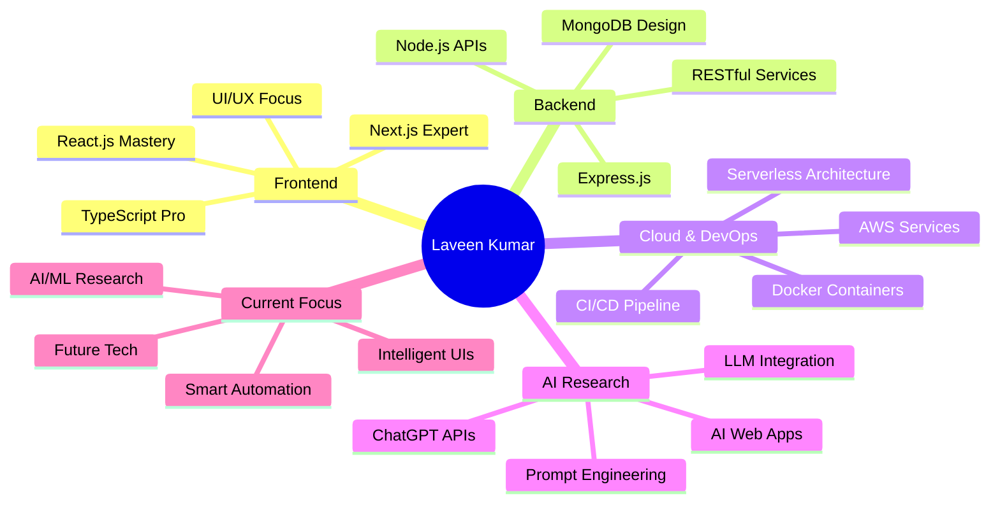

# 👋 Hello World! I'm **Laveen Kumar** 

<div align="center">

[](https://git.io/typing-svg)

</div>

<div align="center">
  
</div>

---

## 🎯 **About Me** 

<div align="center">

### 🚀 **Interactive Developer Profile**

</div>

```javascript
class LaveenKumar extends Developer {
    constructor() {
        super();
        this.name = "Laveen Kumar";
        this.location = "India 🇮🇳";
        this.title = "Full Stack MERN Wizard";
        this.passion = [
            "Building scalable web applications 🌐",
            "Exploring AI/ML integrations 🤖",
            "Cloud architecture mastery ☁️",
            "Creating seamless user experiences ✨"
        ];
        
        // Current Research & Focus Areas
        this.currentResearch = {
            primary: "AI/ML Integration in Web Applications 🧠",
            secondary: "Serverless Architectures & Microservices 🚀",
            exploring: "LLM Fine-tuning & Prompt Engineering 🔬",
            nextGoal: "Building AI-powered SaaS platforms 💡"
        };
        
        this.techStack = {
            frontend: ["React.js", "Next.js", "TypeScript", "JavaScript"],
            backend: ["Node.js", "Express.js", "RESTful APIs"],
            database: ["MongoDB", "Mongoose ODM"],
            cloud: ["AWS Services", "Lambda", "S3", "EC2"],
            ai: ["LLM Integration", "OpenAI API", "ChatGPT"],
            tools: ["Git", "Docker", "Postman", "VS Code"]
        };
        
        this.currentMood = "🔥 Obsessed with AI research";
        this.coffeeLevel = "☕☕☕ (Always High)";
        this.lifePhilosophy = "Code with purpose, innovate boldly, never stop learning! 🌟";
    }
    
    // AI Research Status
    getCurrentFocus() {
        return `🔬 Deep diving into the AI world - researching LLMs, 
                 experimenting with prompt engineering, and building 
                 intelligent web applications that think and adapt!`;
    }
    
    // Fun Fact Generator
    getRandomFact() {
        const facts = [
            "Can debug in my sleep 💤",
            "Thinks in JavaScript, dreams in TypeScript 💭",
            "Has a love-hate relationship with CSS 😅",
            "Believes AI will enhance, not replace developers 🤝"
        ];
        return facts[Math.floor(Math.random() * facts.length)];
    }
    
    // Status Update
    dailyStatus() {
        return {
            morning: "☕ Coffee + Code + AI Research",
            afternoon: "🛠️ Building & Testing Applications",
            evening: "📚 Learning new tech & Reading papers",
            night: "🌙 Planning tomorrow's innovations"
        };
    }
}

// Initialize Developer Instance
const laveen = new LaveenKumar();
console.log(laveen.getCurrentFocus());

// Current AI Research Projects 🧪
const currentExperiments = [
    "🤖 Building ChatGPT-powered web apps",
    "🧠 Experimenting with LLM fine-tuning",
    "⚡ Optimizing React performance with AI insights",
    "☁️ Deploying ML models on AWS serverless"
];

// Developer Status: ACTIVE 🟢
// Research Mode: ON 🔬
// Innovation Level: MAXIMUM 🚀
```

<div align="center">

### 🌟 **Quick Stats Dashboard**

[](https://github.com/Lavin-kulal)

[](https://github.com/Lavin-kulal)

</div>

---

## 🛠️ **Tech Arsenal & AI Playground**

<div align="center">

### **Frontend Magic** ✨


### **Backend Power** ⚡


### **Cloud & DevOps** ☁️


### **AI & LLM Research** 🤖


### **Development Tools** 🔧


</div>

---

## 🚀 **Featured Projects**

<div align="center">

<table>
<tr>
<td width="50%">

### 🌐 **Company Portfolio**
[](https://github.com/Lavin-kulal/company-site)

**Tech:** React, Node.js, MongoDB, AWS  
**Features:** Responsive design, SEO optimized, Cloud deployment

</td>
<td width="50%">

### 🎤 **Conference Website**
[](https://github.com/Lavin-kulal/conference-website)

**Tech:** HTML, CSS, JavaScript, Express.js  
**Features:** Interactive UI, Event management, Real-time updates

</td>
</tr>
<tr>
<td width="50%">

### 🍽️ **Restaurant Platform**
[](https://github.com/Lavin-kulal/restaurant-website)

**Tech:** MERN Stack, TypeScript  
**Features:** Online ordering, Payment integration, Admin dashboard

</td>
<td width="50%">

### 📊 **AI-Powered Speaker Management**
[](https://github.com/Lavin-kulal/speaker-form)

**Tech:** React, Express, AWS, LLM Integration  
**Features:** Smart form validation, AI recommendations, Cloud storage

</td>
</tr>
</table>

</div>

---

## 📊 **GitHub Analytics**

<div align="center">

[](https://github.com/Lavin-kulal)

<table>
<tr>
<td>

[](https://github.com/Lavin-kulal)

</td>
<td>

[](https://github.com/Lavin-kulal)

</td>
</tr>
</table>

</div>

---

## 🤖 **AI Research & Learning Journey**

<div align="center">



### 📈 **Current AI Research Path**
- 🧠 **Large Language Models** - Integration & Fine-tuning
- 🤖 **Prompt Engineering** - Optimizing AI responses
- ⚡ **AI-Powered React Apps** - Smart component behavior
- 🔬 **Machine Learning APIs** - Building intelligent backends
- 🚀 **Next.js + AI** - Server-side AI processing
- ☁️ **AWS AI Services** - Scalable ML deployments

</div>

---

## 🔬 **AI Experiments Lab**

<div align="center">

### 🧪 **Current Research Projects**

| Project | Tech Stack | Status | Description |
|---------|------------|--------|-------------|
| 🤖 **ChatGPT Web Integration** | React + OpenAI API | 🚧 In Progress | Building conversational web interfaces |
| 🧠 **LLM Fine-tuning** | Python + Transformers | 🔬 Research | Custom model training for specific tasks |
| ⚡ **AI-Enhanced React** | React + TensorFlow.js | 💡 Ideation | Smart components that adapt to user behavior |
| ☁️ **AWS ML Pipeline** | AWS Lambda + SageMaker | 📋 Planning | Serverless machine learning workflows |

</div>

---

## 🌟 **Let's Connect & Collaborate!**

<div align="center">

[](https://linkedin.com/in/laveen-kumar)
[](mailto:laveenkumar@email.com)
[](https://laveenkumar.dev)
[](https://twitter.com/laveen_dev)

---

### 💡 **"Building the future with AI, one commit at a time!"** 


### 📫 **Open for:**
- 🚀 Full-time opportunities in AI/Web Development
- 🤝 Open source AI/ML collaborations  
- 💼 Freelance AI integration projects
- 🎯 Mentorship & knowledge sharing in MERN + AI
- 🔬 Research collaborations in LLM applications

---

<details>
<summary>🎉 <strong>Fun Facts About This AI Enthusiast</strong></summary>

- 🌅 Early bird coder - Best algorithms born before 9 AM!
- ☕ Coffee dependency: `while(coding) { drink(coffee); }`
- 🤖 Dreams in JavaScript, thinks in TypeScript, researches in Python
- 🧠 Currently obsessed with making web apps smarter with AI
- 🎮 Gaming break = new problem-solving perspectives
- 📚 Reading AI research papers like novels
- 🎵 Lo-fi beats + coding + AI research = Perfect combo
- 🌍 Mission: Building AI-powered apps that make life easier
- 🔬 Always experimenting with the latest AI tools and APIs
- 💡 Believes: "AI won't replace developers, developers using AI will replace those who don't"

</details>

---

<div align="center">


**Thanks for visiting my AI research journey! Leave a ⭐ if you're excited about the future of AI + Web Development!**

### 🤖 **Current Status:** Researching, Building, Innovating... 🚀

</div>
