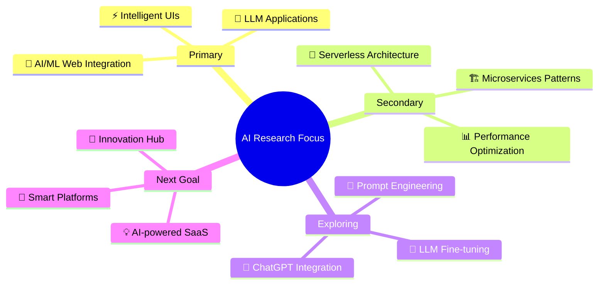

# 🚀 Laveen Kumar | Full Stack MERN Wizard

<div align="center">
  
[](https://git.io/typing-svg)

</div>

<div align="center">


[](https://github.com/laveenkumar)
[](https://github.com/laveenkumar)

</div>

## 🎯 About Me

```javascript
class LaveenKumar extends Developer {
    constructor() {
        super();
        this.name = "Laveen Kumar";
        this.location = "India 🇮🇳";
        this.title = "Full Stack MERN Wizard";
        this.currentMood = "🔥 Obsessed with AI research";
        this.coffeeLevel = "☕☕☕ (Always High)";
        this.lifePhilosophy = "Code with purpose, innovate boldly, never stop learning! 🌟";
    }
    
    getCurrentFocus() {
        return `🔬 Deep diving into the AI world - researching LLMs, 
                 experimenting with prompt engineering, and building 
                 intelligent web applications that think and adapt!`;
    }
}

const laveen = new LaveenKumar();
console.log(laveen.getCurrentFocus());
```

<div align="center">

## 🔥 Current Status

 **Developer Status: ACTIVE** 

**🧠 Research Mode: ON** | **🚀 Innovation Level: MAXIMUM**

</div>

## 💫 Passion & Focus Areas

<div align="center">

| 🌐 Web Applications | 🤖 AI/ML Integration | ☁️ Cloud Architecture | ✨ User Experience |
|:---:|:---:|:---:|:---:|
| Building scalable solutions | Exploring intelligent apps | Mastering cloud patterns | Creating seamless UX |

</div>

## 🧬 Current Research & Innovation Lab

<div align="center">



</div>

## 🛠️ Tech Arsenal

<div align="center">

### Frontend Mastery


### Backend Power


### Cloud & AI


### DevOps & Tools


</div>

## 🧪 Current AI Experiments

<div align="center">

| Project | Status | Tech Stack |
|---------|--------|------------|
| 🤖 ChatGPT-powered Web Apps | 🟢 Active | React + OpenAI API |
| 🧠 LLM Fine-tuning Research | 🟡 Experimenting | Python + Transformers |
| ⚡ AI-Enhanced React Performance | 🔴 Planning | React + ML Optimization |
| ☁️ Serverless ML Deployment | 🟢 Testing | AWS Lambda + TensorFlow |

</div>

## 📊 GitHub Analytics

<div align="center">


</div>

<div align="center">


</div>

## 🏆 Achievement Highlights

<div align="center">

[](https://github.com/laveenkumar)

</div>

## 🎭 Fun Developer Facts

<div align="center">

```javascript
const randomFacts = [
    "🛌 Can debug in my sleep",
    "💭 Thinks in JavaScript, dreams in TypeScript", 
    "😅 Has a love-hate relationship with CSS",
    "🤝 Believes AI will enhance, not replace developers",
    "☕ Coffee is my debugging fuel",
    "🌙 Best code happens after midnight"
];

// Generate random fact
console.log(randomFacts[Math.floor(Math.random() * randomFacts.length)]);
```

</div>

## 📅 Daily Developer Routine

<div align="center">

| Time | Activity |
|------|----------|
| 🌅 Morning | ☕ Coffee + Code + AI Research |
| 🌞 Afternoon | 🛠️ Building & Testing Applications |
| 🌆 Evening | 📚 Learning new tech & Reading papers |
| 🌙 Night | 💡 Planning tomorrow's innovations |

</div>

## 🌊 Activity Graph

<div align="center">

[](https://github.com/laveenkumar)

</div>

## 🤝 Let's Connect & Collaborate!

<div align="center">

[](https://linkedin.com/in/laveenkumar)
[](https://twitter.com/laveenkumar)
[](mailto:laveenkumar@example.com)
[](https://laveenkumar.dev)

</div>

<div align="center">

## 💝 Support My Work

[](https://buymeacoffee.com/laveenkumar)
[](https://github.com/sponsors/laveenkumar)

---

 **Thanks for visiting my profile!** 


**⭐ Star my repos if you find them useful!** | **🚀 Let's build the future together!**

</div>

<div align="center">


</div>

---

<div align="center">
  
**"Code with purpose, innovate boldly, never stop learning! 🌟"**

*- Laveen Kumar*

</div>
