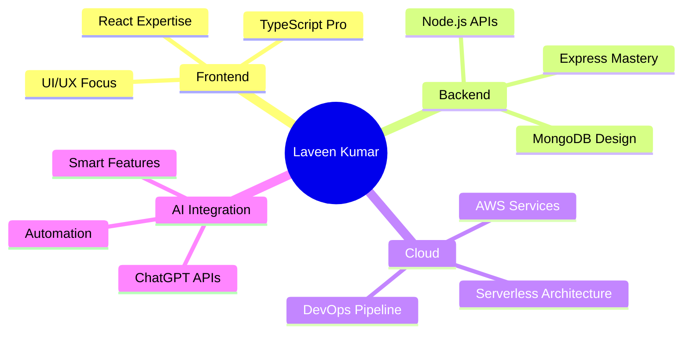

# 👋 Hello World! I'm **Laveen Kumar** 

<div align="center">

[](https://git.io/typing-svg)

</div>

<div align="center">
  
</div>

---

## 🎯 **About Me** 

```javascript
const laveenKumar = {
    location: "India 🇮🇳",
    role: "Full Stack Developer",
    passion: "Building scalable web applications with cutting-edge tech",
    currentFocus: "AI Integration & Cloud Architecture",
    lifePhilosophy: "Code with purpose, learn continuously, innovate boldly! ✨"
};

// AI-Powered Insight: Currently optimizing React performance 
// and exploring serverless architectures on AWS! 🚀
```

<div align="center">

### 🌟 **Quick Stats Dashboard**

[](https://github.com/Lavin-kulal)

[](https://github.com/Lavin-kulal)

</div>

---

## 🛠️ **Tech Arsenal**

<div align="center">

### **Frontend Magic** ✨


### **Backend Power** ⚡


### **Cloud & DevOps** ☁️


### **AI & Tools** 🤖


</div>

---

## 🚀 **Featured Projects**

<div align="center">

<table>
<tr>
<td width="50%">

### 🌐 **Company Portfolio**
[](https://github.com/Lavin-kulal/company-site)

**Tech:** React, Node.js, MongoDB  
**Features:** Responsive design, SEO optimized

</td>
<td width="50%">

### 🎤 **Conference Website**
[](https://github.com/Lavin-kulal/conference-website)

**Tech:** HTML, CSS, JavaScript  
**Features:** Interactive UI, Event management

</td>
</tr>
<tr>
<td width="50%">

### 🍽️ **Restaurant Platform**
[](https://github.com/Lavin-kulal/restaurant-website)

**Tech:** MERN Stack  
**Features:** Online ordering, Real-time updates

</td>
<td width="50%">

### 📊 **Speaker Management**
[](https://github.com/Lavin-kulal/speaker-form)

**Tech:** React, Express, AWS  
**Features:** Form validation, Cloud storage

</td>
</tr>
</table>

</div>

---

## 📊 **GitHub Analytics**

<div align="center">

[](https://github.com/Lavin-kulal)

<table>
<tr>
<td>

[](https://github.com/Lavin-kulal)

</td>
<td>

[](https://github.com/Lavin-kulal)

</td>
</tr>
</table>

</div>

---

## 🤖 **AI-Powered Insights**

<div align="center">



### 📈 **Current Learning Path (AI Suggested)**
- 🔥 **Next.js 14** - App Router & Server Components
- ☁️ **AWS CDK** - Infrastructure as Code
- 🤖 **LangChain** - AI Application Framework
- 🚀 **Microservices** - Scalable Architecture

</div>

---

## 🌟 **Let's Connect & Collaborate!**

<div align="center">

[](https://linkedin.com/in/laveen-kumar)
[](mailto:laveenkumar@email.com)
[](https://laveenkumar.dev)
[](https://twitter.com/laveen_dev)

---

### 💡 **"Building the future, one commit at a time!"** 


### 📫 **Open for:**
- 🚀 Full-time opportunities
- 🤝 Open source collaborations  
- 💼 Freelance projects
- 🎯 Mentorship & knowledge sharing

---

<details>
<summary>🎉 <strong>Fun Facts About Me</strong></summary>

- 🌅 Early bird - Best code written before 9 AM!
- ☕ Coffee dependency level: `console.log("CRITICAL")`
- 🎮 Gaming enthusiast when not coding
- 📚 Always learning something new
- 🎵 Code better with music on
- 🌍 Dream: Building apps that change lives

</details>

---

<div align="center">


**Thanks for visiting! Leave a ⭐ if you like my work!**

</div>

</div>
