# 🚀 Laveen Kumar | Full Stack MERN Wizard

<div align="center">

[](https://git.io/typing-svg)


[](https://github.com/Lavin-kulal?tab=followers)
[](https://github.com/Lavin-kulal)

</div>

---

## 🎯 **About Me** 

<div align="center">

</div>

```javascript
class LaveenKumar extends FullStackDeveloper {
    constructor() {
        super();
        this.name = "Laveen Kumar";
        this.location = "Mangaluru, Karnataka, India 🇮🇳";
        this.title = "Full Stack MERN Wizard";
        this.currentFocus = "🧠 AI Research & LLM Integration";
        this.passion = "Building scalable, intelligent web applications";
        this.lifePhilosophy = "Code with purpose, innovate boldly, learn continuously! ✨";
        this.currentMood = "🔥 Obsessed with AI-powered development";
        this.coffeeLevel = "☕☕☕ (Always Maximum)";
    }
    
    getCurrentResearch() {
        return [
            "🔬 Large Language Models (LLMs) integration",
            "⚡ React performance optimization with AI",
            "🚀 Serverless AI-powered architectures",
            "💡 Intelligent UI/UX patterns",
            "🤖 ChatGPT API implementations"
        ];
    }
    
    getLifeGoals() {
        return "🌟 Building AI-enhanced applications that solve real-world problems";
    }
}

const laveen = new LaveenKumar();
console.log("🚀 Ready to innovate:", laveen.getLifeGoals());
```

<div align="center">

### 🔥 **Current Developer Status**

 **INNOVATION MODE: ACTIVE** 

**🧠 AI Research: ON** | **⚡ Performance Mode: MAXIMUM** | **🚀 Learning: CONTINUOUS**

</div>

---

## 🛠️ **Tech Arsenal & Superpowers**

<div align="center">

### **🎨 Frontend Mastery**


### **⚡ Backend Power**


### **☁️ Cloud & DevOps**


### **🤖 AI & Advanced Tools**


</div>

---

## 🧬 **AI Research & Innovation Lab**

```mermaid
mindmap
  root((Laveen Kumar))
    Frontend Expertise
      ⚛️ React Advanced Patterns
      📱 Next.js App Router
      🎨 TypeScript Architecture
      ✨ Performance Optimization
    Backend Mastery  
      🚀 Node.js APIs
      📊 MongoDB Design
      ⚡ Express Middleware
      🔐 Authentication Systems
    Cloud Architecture
      ☁️ AWS Services
      🔄 Serverless Patterns
      📦 Docker Containers
      🚀 CI/CD Pipelines
    AI Integration
      🧠 LLM Applications  
      💬 ChatGPT APIs
      🤖 Smart Automation
      📈 ML Model Deployment
    Current Research
      🔬 Prompt Engineering
      ⚡ AI-Enhanced Performance
      🌐 Intelligent Web Apps
      💡 Next-Gen UX Patterns
```

<div align="center">



</div>

### 🔬 **Current AI Experiments**

<div align="center">

| 🚀 Project | 📊 Status | 🛠️ Tech Stack | 🎯 Innovation |
|------------|-----------|---------------|---------------|
| 🤖 **AI-Powered React Apps** | 🟢 **Active** | React + OpenAI API + TypeScript | Smart component generation |
| 🧠 **LLM Integration Framework** | 🟡 **Research** | Node.js + LangChain + MongoDB | Seamless AI workflows |
| ⚡ **Performance AI Assistant** | 🔴 **Planning** | React + ML Analytics | Auto-optimization suggestions |
| 🌐 **Intelligent Web Platform** | 🟢 **Building** | MERN + AI APIs + AWS | Context-aware applications |

</div>

---

## 📊 **GitHub Analytics & Performance**

<div align="center">


<br><br>

[](https://github.com/Lavin-kulal)

</div>

### 🏆 **Achievement Gallery**

<div align="center">

[](https://github.com/Lavin-kulal)

</div>

### 📈 **Contribution Activity**

<div align="center">

[](https://github.com/Lavin-kulal)

</div>

---

## 🚀 **Featured Projects Showcase**

<div align="center">

<table>
<tr>
<td width="50%">

### 🌐 **Enterprise Portfolio Platform**
[](https://github.com/Lavin-kulal/company-site)

**🛠️ Tech Stack:** React • Node.js • MongoDB • AWS  
**✨ Features:** Responsive Design • SEO Optimized • Performance Tuned  
**🚀 Innovation:** AI-powered content management

</td>
<td width="50%">

### 🎤 **Interactive Conference Hub**
[](https://github.com/Lavin-kulal/conference-website)

**🛠️ Tech Stack:** HTML5 • CSS3 • Vanilla JS • Animations  
**✨ Features:** Interactive UI • Event Management • Real-time Updates  
**🚀 Innovation:** Smooth micro-interactions

</td>
</tr>
<tr>
<td width="50%">

### 🍽️ **Smart Restaurant Platform**
[](https://github.com/Lavin-kulal/restaurant-website)

**🛠️ Tech Stack:** MERN Stack • Socket.io • Stripe API  
**✨ Features:** Online Ordering • Real-time Tracking • Payment Integration  
**🚀 Innovation:** AI-powered recommendations

</td>
<td width="50%">

### 📊 **Advanced Speaker Management**
[](https://github.com/Lavin-kulal/speaker-form)

**🛠️ Tech Stack:** React • Express • AWS S3 • MongoDB  
**✨ Features:** Advanced Validation • Cloud Storage • Analytics  
**🚀 Innovation:** Smart form auto-completion

</td>
</tr>
</table>

</div>

---

## 🌟 **Developer Lifestyle & Philosophy**

<div align="center">

### 📅 **Daily Innovation Routine**

| ⏰ Time | 🎯 Activity | 💡 Focus |
|---------|-------------|-----------|
| 🌅 **5:00-8:00 AM** | ☕ Coffee + Code + AI Research | Deep learning & problem solving |
| 🌞 **9:00-12:00 PM** | 🛠️ Active Development | Building & testing applications |
| 🌤️ **1:00-5:00 PM** | 🚀 Innovation Projects | Experimenting with new tech |
| 🌆 **6:00-8:00 PM** | 📚 Learning & Reading | AI papers & tech articles |
| 🌙 **9:00-11:00 PM** | 💭 Planning & Reflection | Tomorrow's innovations |

### 🎭 **Developer Personality**

```javascript
const developerPersonality = {
    codeStyle: "Clean, performant, and readable 🎨",
    debuggingAbility: "Can fix bugs in my sleep 😴",
    learningMode: "Always on, never off 🔄",
    problemSolving: "Think outside the box 📦➡️🌟",
    collaboration: "Team player with leadership skills 🤝",
    innovation: "AI enthusiast building tomorrow's web 🚀",
    funFact: "Dreams in JavaScript, thinks in TypeScript 💭"
};

// Life motto
console.log("🌟 Code with purpose, innovate boldly, never stop learning!");
```

</div>

---

## 📚 **Learning & Development Path**

<div align="center">

### 🎯 **2024 AI-Focused Learning Journey**


### 🚀 **Current Learning Focus**


</div>

---

## 🤝 **Let's Connect & Collaborate!**

<div align="center">


### 🌐 **Professional Networks**

[](https://linkedin.com/in/laveen-kumar)
[](https://twitter.com/laveen_dev)
[](mailto:laveenkumar@email.com)
[](https://laveenkumar.dev)

### 💼 **Open For Opportunities**

```javascript
const opportunities = {
    fullTime: "🚀 Senior Full Stack Developer positions",
    freelance: "💼 Complex web application projects", 
    collaboration: "🤝 Open source AI-powered projects",
    mentorship: "🎯 Knowledge sharing & tech guidance",
    speaking: "🎤 Tech conferences & webinars",
    consulting: "💡 Technical architecture & AI integration"
};

// Ready to innovate together!
console.log("🌟 Let's build the future of web development!");
```

</div>

---

## 🎉 **Fun Developer Facts & Quirks**

<div align="center">

<details>
<summary>🎭 <strong>Click to Discover My Developer Personality!</strong></summary>

<br>

### 🧠 **Mind of a Developer**
- 🌅 **Early Bird Coder**: Best algorithms come before 9 AM
- ☕ **Coffee Dependency**: `console.log("CRITICAL LEVEL REACHED")`
- 🎮 **Gaming Balance**: Strategy games for problem-solving skills
- 🎵 **Code Soundtrack**: Lo-fi beats for deep focus sessions
- 🌍 **Global Vision**: Building apps that impact lives worldwide
- 🔮 **Future Dreamer**: Imagining AI-powered development workflows

### 💡 **Unique Traits**
- 🐛 Can debug complex issues while explaining them to a rubber duck
- 🚀 Gets excited about performance optimizations and clean code
- 📱 Always thinking about mobile-first responsive design
- 🤖 Fascinated by the intersection of AI and web development
- 🎨 Believes great UX is as important as great code
- 🌟 Constantly amazed by how technology can solve real problems

### 🎯 **Dream Projects**
- 🧠 AI-powered code review assistant
- 🌐 Next-generation developer tools
- 🚀 Platforms that democratize AI access
- 💡 Educational tech that adapts to learning styles

</details>

</div>

---

## 💎 **Support My Innovation Journey**

<div align="center">


### ☕ **Fuel More Innovation**

[](https://buymeacoffee.com/laveenkumar)
[](https://github.com/sponsors/Lavin-kulal)

**Your support helps me:**
- 🔬 Dedicate more time to AI research
- 🚀 Build open-source developer tools  
- 📚 Create educational content
- 💡 Experiment with cutting-edge technologies

</div>

---

<div align="center">

### 🌟 **Thanks for visiting my digital universe!** 


### 💫 **Let's Shape the Future Together!**

**⭐ Star my repositories if they inspire you!** | **🚀 Fork and contribute to open source!** | **💬 Let's discuss the future of web development!**

---


</div>

---

<div align="center">

### 🎯 **"Building tomorrow's web with today's passion!"**

*~ Laveen Kumar | Full Stack MERN Wizard*

**🌟 Innovate • 🚀 Inspire • 💡 Impact**

</div>
